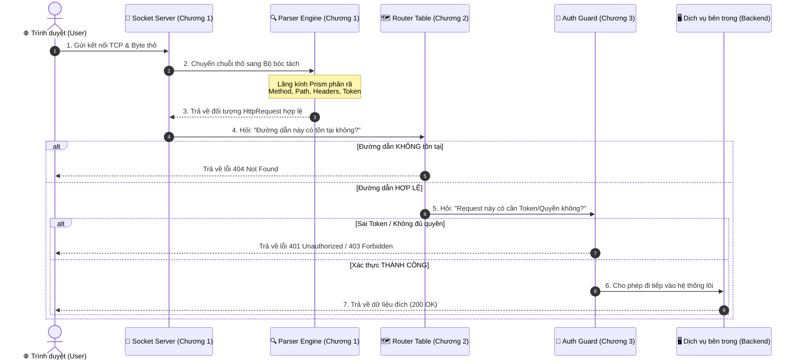

```mermaid
sequenceDiagram
    autonumber
    actor Client as 🌐 Trình duyệt (User)
    participant GW_Server as 🔌 Socket Server (Chương 1)
    participant GW_Parser as 🔍 Parser Engine (Chương 1)
    participant GW_Router as 🗺️ Router Table (Chương 2)
    participant GW_Auth as 🔑 Auth Guard (Chương 3)
    participant Backend as 🖥️ Dịch vụ bên trong (Backend)

    Client->>GW_Server: 1. Gửi kết nối TCP & Byte thô
    GW_Server->>GW_Parser: 2. Chuyển chuỗi thô sang Bộ bóc tách
    Note over GW_Parser: Lăng kính Prism phân rã<br/>Method, Path, Headers, Token
    GW_Parser-->>GW_Server: 3. Trả về đối tượng HttpRequest hợp lệ
    GW_Server->>GW_Router: 4. Hỏi: "Đường dẫn này có tồn tại không?"
    
    alt Đường dẫn KHÔNG tồn tại
        GW_Router-->>Client: Trả về lỗi 404 Not Found
    else Đường dẫn HỢP LỆ
        GW_Router->>GW_Auth: 5. Hỏi: "Request này có cần Token/Quyền không?"
        alt Sai Token / Không đủ quyền
            GW_Auth-->>Client: Trả về lỗi 401 Unauthorized / 403 Forbidden
        else Xác thực THÀNH CÔNG
            GW_Auth->>Backend: 6. Cho phép đi tiếp vào hệ thống lõi
            Backend-->>Client: 7. Trả về dữ liệu đích (200 OK)
        end
    end

```