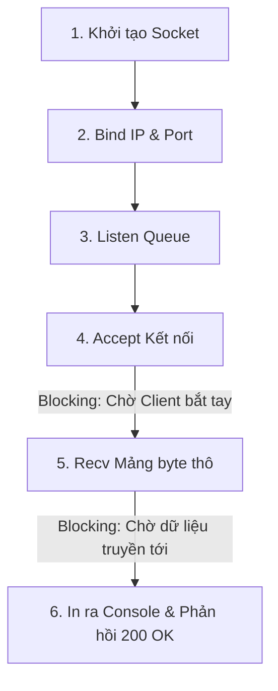

```mermaid
graph TD
    A["1. Khởi tạo Socket"] --> B["2. Bind IP & Port"]
    B --> C["3. Listen Queue"]
    C --> D["4. Accept Kết nối"]
    D -->|"Blocking: Chờ Client bắt tay"| E["5. Recv Mảng byte thô"]
    E -->|"Blocking: Chờ dữ liệu truyền tới"| F["6. In ra Console & Phản hồi 200 OK"]

```